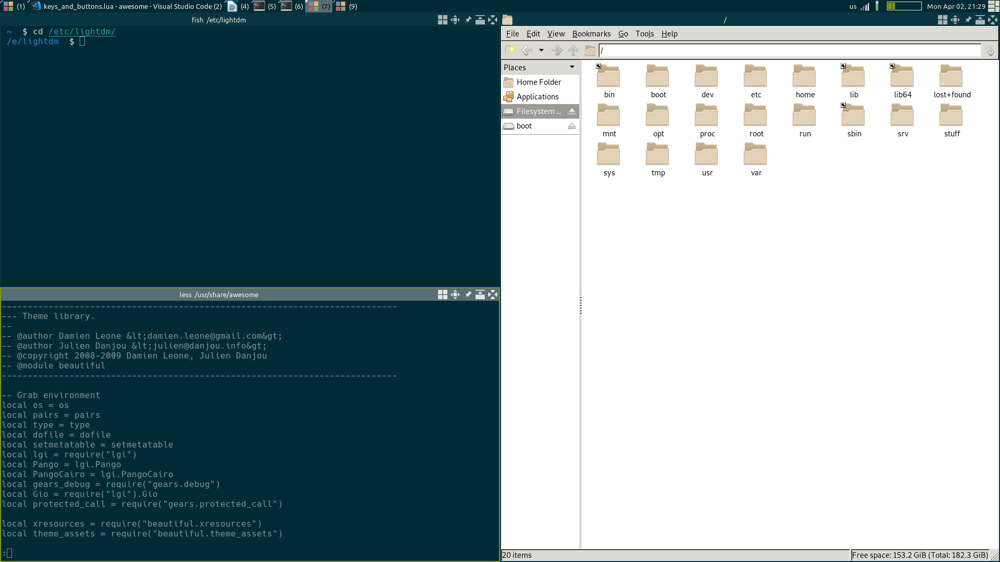

Dark solarized awesome wm theme
===============================

Based on Gwenhael Le Moine <gwenhael.le.moine@gmail.com> theme <https://github.com/gwenhael-le-moine/awesome-solarized>.

Uses [Solarized color scheme][solarized].

Uses images:
 - Wallpaper [Solarized Mountains by 9beat7][solarized-mountains]
 - Icons from [Font Awesome][font-awesome]
 - Titlebar icons from [default awesomwe wm theme][awesome-default]
 - Layout icons from [zenburn awesome wm theme][awesome-zenburn]

[solarized]: http://ethanschoonover.com/solarized
[solarized-mountains]: https://9beat7.deviantart.com/art/Solarized-Mountains-530027093
[font-awesome]: https://fontawesome.com/
[awesome-default]: https://github.com/awesomeWM/awesome/tree/master/themes/default
[awesome-zenburn]: https://github.com/awesomeWM/awesome/tree/master/themes/zenburn

Installation
------------

Theme can be copied in any directory.
I will use `~/.config/awesome/themes/solarized` as an example.

    $ mkdir -p ~/.config/awesome/themes
    $ git clone git://github.com/funtaps/awesome-solarized.git ~/.config/awesome/themes/solarized

Then initialize beatiful in your `rc.lua` with this theme (you can use absolute address or `awful.util.getdir("config")`):

    beautiful.init(awful.util.getdir("config").."/themes/solarized/theme.lua")

Screenshots
-----------

